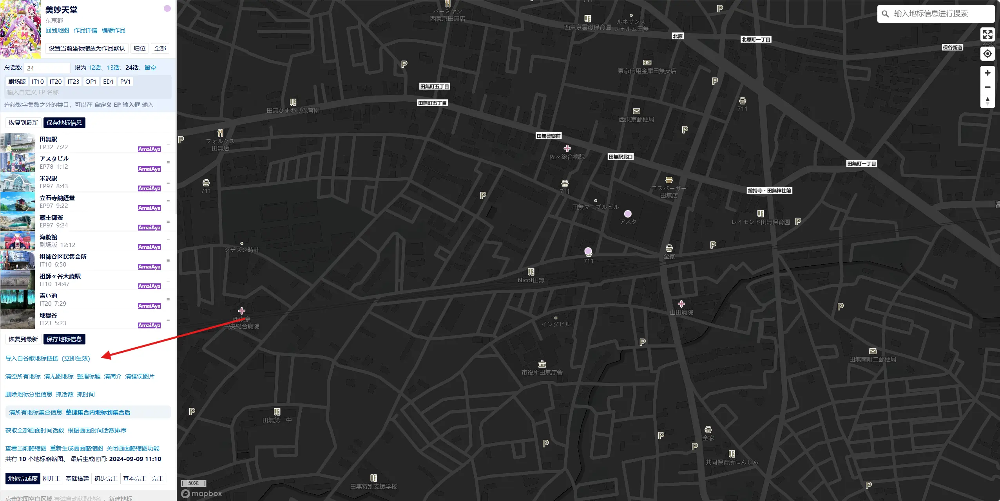
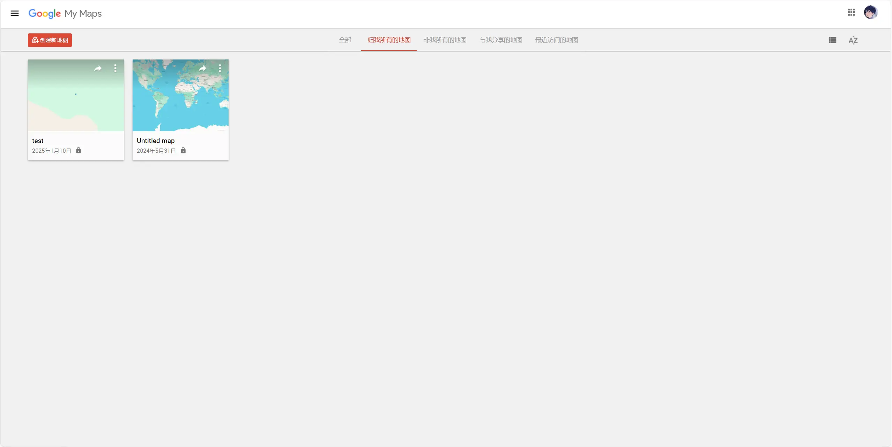
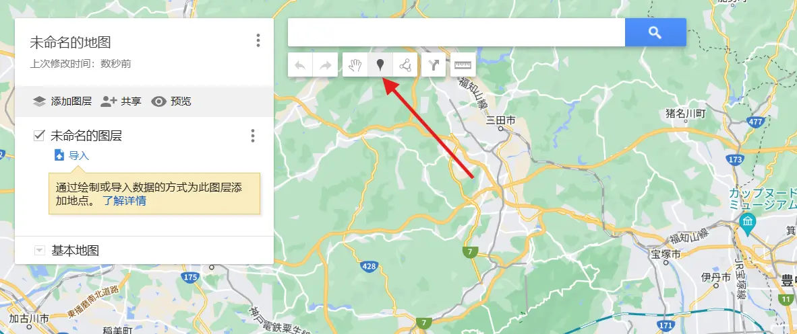
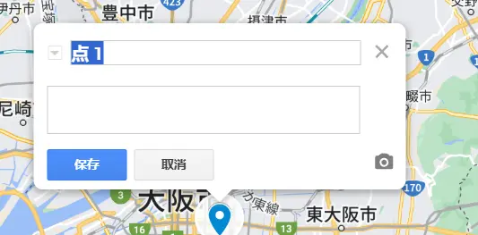
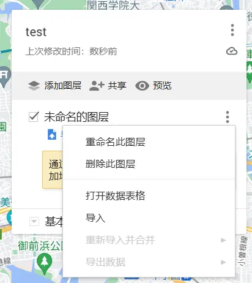
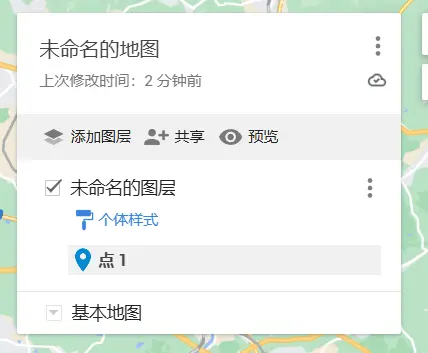
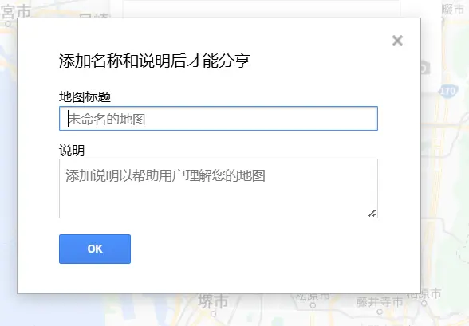
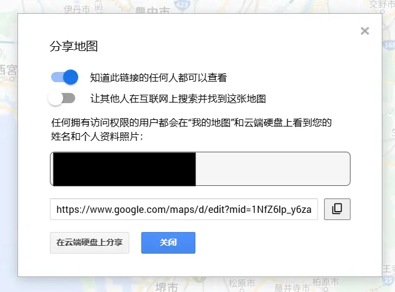

该功能可以将 Google My Map 中的地标导入到当前作品中

:::warning

添加的地标会不经审核直接添加到列表末尾

:::
## 入口

点击后在弹出的对话框点击确认，输入地址即可导入

地址格式为：https://www.google.com/maps/d/edit?mid=xxx

## Google My Map 教学

### 使用场景 1：还没标记地标
打开 [My Map](https://www.google.com/maps/d/)

点击创建新地图，接着会跳转到地图界面 \
在工具栏选中如箭头所示的添加标记工具

左键单击地图上某处即可添加地标

在上方输入框可以输入地标名，下方可以输入简介

> 如果已经有坐标，可以粘贴到输入框并回车，在地图上就会弹出该坐标的对话框，点击添加至地图即可

### 使用场景 2：已经有 kml 文件
点击省略号，在菜单中点击导入，选择文件即可

### 使用场景 3：在 google map 上有已保存列表
原先可以使用 Google Takeout，但是本文写作时 (2025/1/10) 已经不可用，目前暂时没有好的方案。只能从以保存列表中一个一个将地标经纬度坐标复制出来粘贴到 my map 中。 \
如果你有好的方案可以提供，欢迎在 https://github.com/anitabi/anitabi.cn-document/issues 讨论

### 通用部分
#### 如何获取链接
在地图界面点击共享

输入标题和简介

打开第一个开关，复制链接

