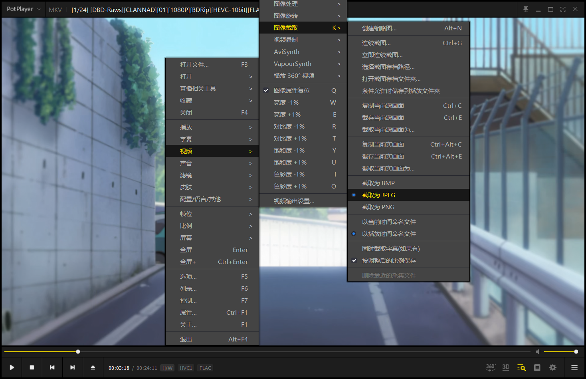
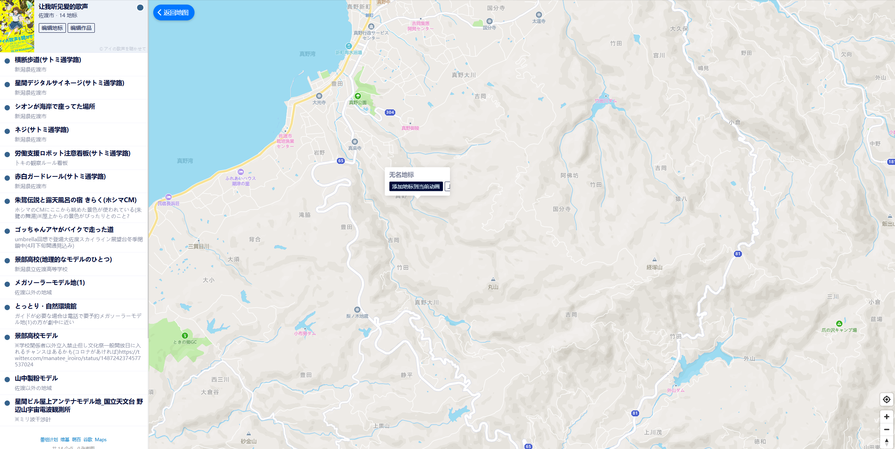

# 添加地标

## 为地图上搜不到的动画添加地标

首先，在地图上找到地标的准确位置，接着在该点左键单击，会弹出来一个小窗口，

接着点击添加地标进入操作界面
### step 1 选择作品
点击 选择对应作品，就会出现如下的界面

在搜索框中输入作品名称，如果有对应作品，点击作品即可添加

如果没有对应作品，请访问 [番组计划](https://bangumi.tv/)，在其中找到你的作品，复制作品的地址\
例：`https://bangumi.tv/subject/443428`\
复制后，粘贴到输入框中并回车，即可看到作品，点击即可添加

### step 2 添加作品截图
添加作品截图时建议使用 potplayer 或其他具有截图功能的播放器，不仅可以直接从文件名获取对应集数和时间，还避免了比例和画质差错等一系列问题\
下面以 potplayer 为例示范截取过程\
首先，右键画面，选择 视频>图像截取，然后将设置调整成如下（截取为 jpeg、以播放时间命名文件）

接着点击 <b>截取当前源画面为</b>，然后选择一个地方放置文件\
点击对应作品截图的灰框选择文件或将文件直接拽入，就上传成功了

> Tips:\
> 截图的标准尺寸是 16:9，当上传非标准尺寸时，会提示是否需要裁剪，如果点击需要，会按照 16:9 的比例进行裁剪\
> 裁剪方式如下图\
> 
>
> 如果不裁剪，则会上传原尺寸画面，在展示时，若画面比例大于 16:9，会出现上下两边留白的情况

最后确认截图对应集数以及播放时间是否正确，如有缺漏或错误将其补全
### step 3 填入相应信息
按照要求填入作品的原名、英文名、中文名、分组、说明信息、来源（如非必填可不填）
### step 4 检查信息
这步真的很重要捏

接着 <b>点击提交地标到动画巡礼</b> 就完成了
## 为已有的动画添加地标
先在地图上点击作品地标或搜索作品名称，进入作品\
然后找到你要添加地标的位置，左键单击，再点击 <b>添加地标到当前动画</b>\
进入界面后就跟上面的操作是一样的啦
