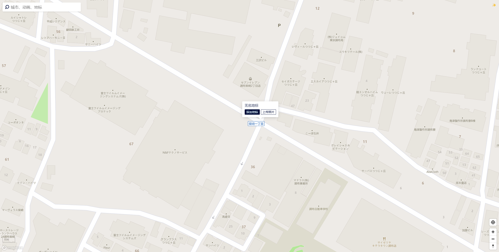
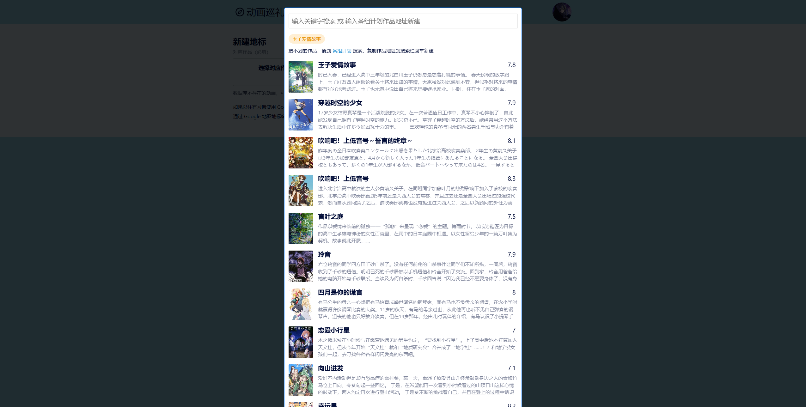

# 添加地标

## 为地图上搜不到的动画添加地标

首先，在地图上找到地标的准确位置，接着在该点左键单击，会弹出来一个小窗口，

接着就会进入添加地标界面，点击 选择对应作品，就会出现如下的界面

在搜索框中输入作品名称，如果有对应作品，点击作品即可添加

如果没有对应作品，请访问 [番组计划](https://bangumi.tv/)，在其中找到你的作品，复制作品的地址\
例：`https://bangumi.tv/subject/443428`\
复制后，粘贴到输入框中并回车，即可看到作品，点击即可添加

## 为已有的动画添加地标