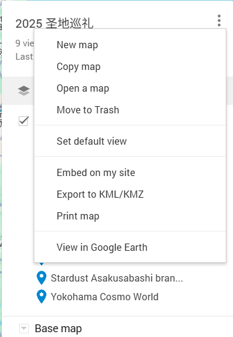
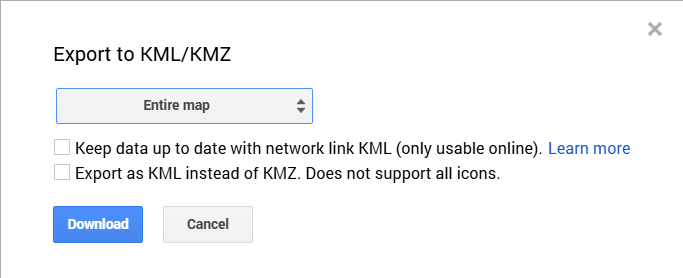
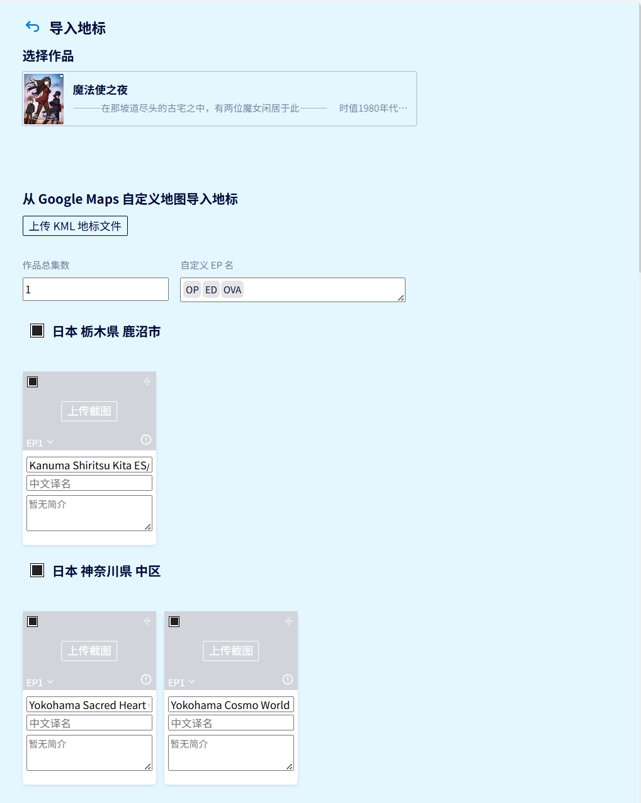
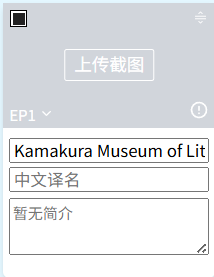
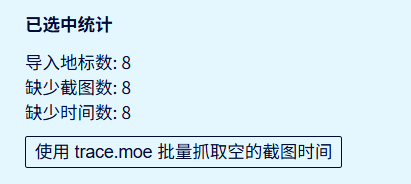
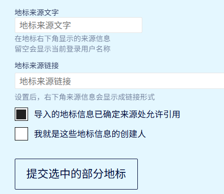

:::info[🌟新功能]
本功能刚刚加入，欢迎大家提出意见和反馈 BUG
:::

:::tip[什么是 KML/KMZ?]
KML 是基于 XML 语法标准的一种标记语言，用来表达地理标记 [WikiPedia](https://zh.wikipedia.org/wiki/KML)\
KMZ 是 KML 文件及相关资源的压缩包
:::

## 从哪里可以导出 KML/KMZ
### Google My Map

点开一个项目，点击省略号按钮，在菜单里选择 Export to KML/KMZ。

在导出界面，你可以选择导出整个地图或部分图层。在目前的导入中，图层并不会产生影响，最终地标会按地域进行分组。

这样你就得到了一个 KML/KMZ 文件，可以用来导入了。
### 编程
你可以自己手动编写程序从你喜爱的任意来源导入数据并将其转换成 KML 格式

## 导入到 anitabi

访问 [导入页面](https://anitabi.cn/import)

选择要导入的作品，然后点击 `上传 KML 地标文件按钮`，等待读取\
如果长时间处于加载状态，那有可能是读取出了问题，你可以重试或按 F12 呼出开发者工具，切到 console tab，将内容截图发送给我们。

在集数管理区，你可以设定作品的集数和自定义 EP 名，这些集会出现在下方的集数选择菜单里。

在卡片里，你可以在下方的信息区修改原名、中文译名以及简介。将鼠标悬浮到集数的下拉图标，会出现选集菜单。在集数的右方会有时间状态提示图标，当时间未设置时会显示感叹号。

在卡片的右上角有一个图标，点击并拖拽可以移动卡片的顺序。左上角的单选框可以切换地标提交与否的状态。

由于目前的设计限制，暂时不能手动为地标设置时间。请统一上传好截图之后，点击下方的 `使用 trace.moe 批量抓取空的截图时间` 按钮抓取时间。如果抓取不到时间或时间有误，可以提交后再单个修改（逃

在下方的统计区，可以看到导入地标数、缺少截图数和缺少时间数。

在页面最下方可以设置地标来源文字和地标来源链接。如果这些地标是你自己创建的，可以勾选 `我就是这些地标信息的创建人`，就不需要填写地标来源文字和链接了。如果不是，则需要填写并勾选 `导入的地标信息已确定来源处允许引用`。

最后提交即可

