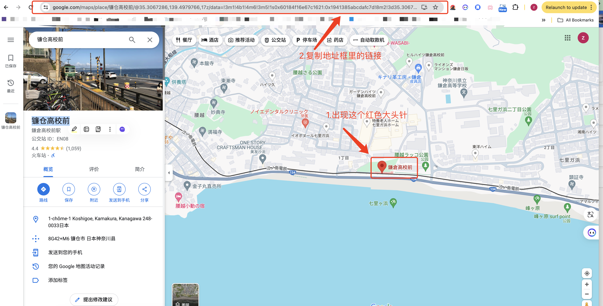
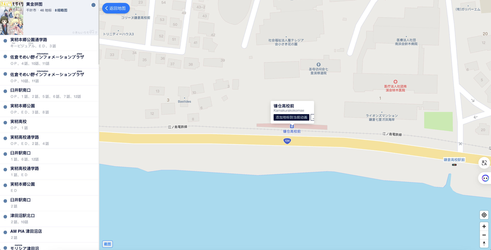

如果你在谷歌地图中已经标记好了一些你想要去巡礼的地点，可以通过以下方式在 anitabi 上来查看你想去的地点的附近的其他动画巡礼地点。

1. 在谷歌地图中搜索你想去的地方，比如镰仓高校前

选择你想去的地方敲下回车，你的网页里会出现一个红色大头针以及左侧的描述。

2.复制这个网页的地址，比如在我的这个例子里，这个链接长这样

``
https://www.google.com/maps/place/Kamakurak%C5%8Dk%C5%8D-Mae+Station/@35.3067242,139.5005569,17z/data=!3m1!4b1!4m6!3m5!1s0x60184f16e67c1621:0x1941385abcdafc7d!8m2!3d35.3067242!4d139.5005569!16s%2Fm%2F02vnkjw
``

3.打开 anitabi，直接 `Ctrl+V` 即可飞到对应的地点。

