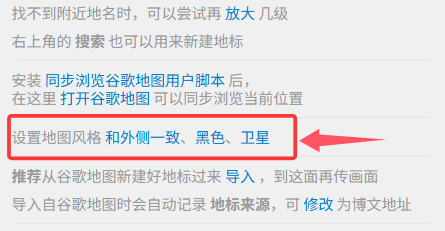
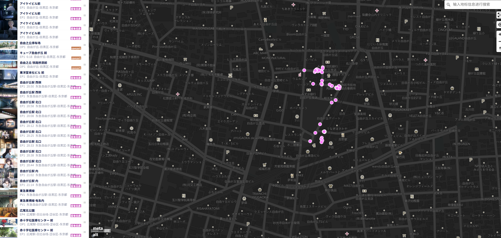
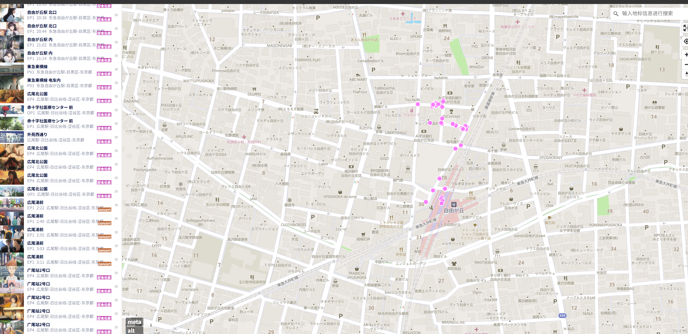
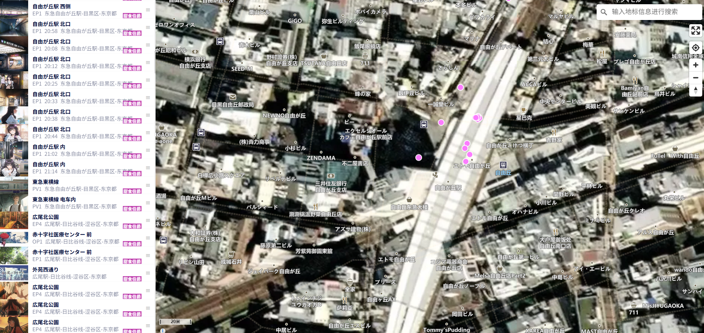
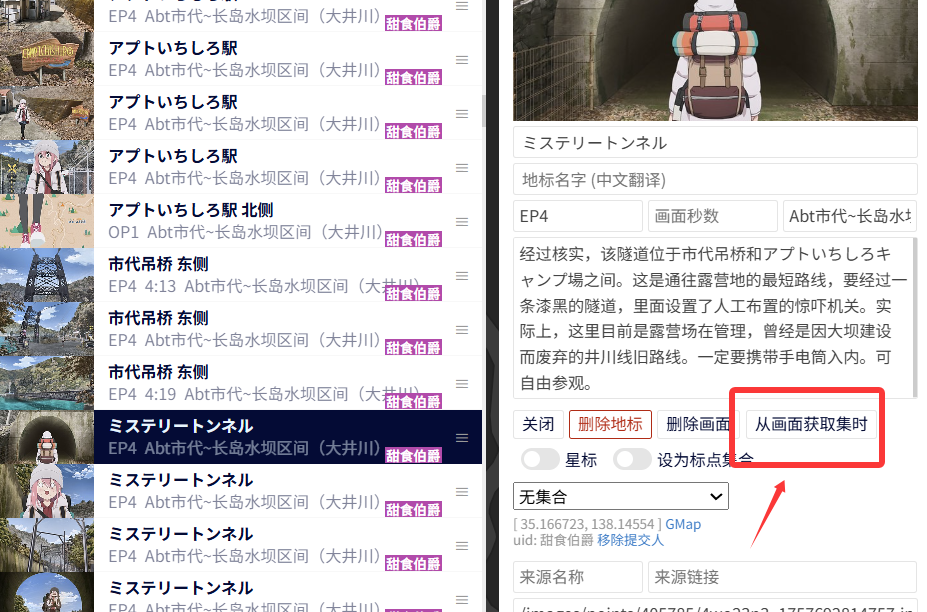
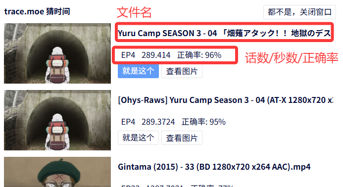

# 🍙地标编辑器教程

本指南记录了通过地标编辑器批量编辑 [Anitabi](https://anitabi.cn/map) 地标的一些方法与 Tips，为拥有编辑权限的管理员用户提供一些快速参考。

## 基础编辑办法

### 切换地图风格

在通过编辑器修改作品地标前，可以先拉到编辑器底部，找到**设置地图风格**一栏。如下所示：

|  |
|---------------------------------------------------------------|
| （在编辑器底部，可以将地图风格切换为不同样式)                                       |

编辑器提供三种**地图风格**：黑色（默认）、和外侧一致和卫星地图。编辑者可以根据自己的喜好和使用场景选择不同的地图风格：

|地图风格|说明&适用场景|
|---------------------------------------------------------------|------------------------------------------------------------------------------------------------------------|
|    | **深色风格**: 编辑器的默认地图风格，加载资源最少/速度最快。适用场景：（1）对某地标内容进行快速修改（2）在某地标周边新增地标（i.e. 可以以相邻地标作为快速参照物的情况）。                  |
|     | **和外侧一致(明亮风格)**: 用户侧所使用的地图风格，对湖泊、公园、车站等高辨识度地标有更直观的标识。适用场景：已经通过其他方式（如谷歌地图）确定了地标的大致位置，需要以特定地标为参照物，在编辑器上新增标点的情况。 | 
|  | **卫星地图风格:**: 加载资源最多/速度最慢。适用场景：需要通过卫星视角修正坐标的情况。不推荐使用编辑器内置的卫星地图从头找点，因为谷歌的卫星地图不仅加载更快，其包含的地图信息也更多。             | 

### 新增地标

|  | **管理员可以在地图的任何空位上单击创建空地标**           |
|-------------------------------------------------------------|-------------------------------------|
|                             | **成功创建地标后会出现新建的空地标，通过新窗口可以编辑该地标的信息** | 

首先在地图上找到希望新增标点的位置，然后**单击**该位置，即可在该位置上生成一个默认地标。

地标如果位于**已有**地理信息的位置上，则自动以该地理位置命名（在这个例子中，如果你在横尾山的位置新建地标，就会自动命名为横尾山）。
否则，将按照**地标顺序**命名（例如，第208个地标会命名为208）。

在某些**缩放等级**下不允许新建地标，这种情况下需要放大地图的缩放比例。

编辑器右上角的**搜索框**也可以用于新建地标。

:::tip
1. 在**新建地标A**时，如果该地标是某个**已有地标B**的**相邻地标**，可以先在地标列表中**单击地标B**。在已单选某地标的状态下，此时在地图上创建新地标A时，新地标A会被**插入排序**到地标B的下面，而非默认的地标列表底部。对于地标数量较多的作品，善用该特性可以更高效地完成地标与分组的排序。
2. 善用右上角的搜索框，通过**邮政编码**等关键词快速定位标点坐标，这是在空白区域新建地标时相对高效的方法。例如，对于品川防災船着場，可以先输入它的邮编108-0075（邮编可以在谷歌地图查到），这通常会直接将新地标定位到目标坐标**附近**。但是在大多数情况下，通过邮编定位的坐标都与目标坐标存在不小的**偏差**。因此，在通过邮编新建地标后，**通常需要对坐标进行手动纠偏。**
:::

:::warning
由于新建地标是通过鼠标**单击**完成的，因此非常容易在拖拽地图时**误触**导致创建了新的空地标。因此，需要留意编辑器的提示，最好在每次保存前检查地标**列表底部**是否有**多余**的空地标。
:::

---

### 编辑地标信息

|            |   | |  |
|--------------------------------------------------------------------------------|-----------------------------------------------------------------------|--------------------------------------------------------------------------------|-----------------------------------------------------------------------|
| 地标截图、中/日文名、对应EP和时间戳、分组                                                        | 地标的描述信息                       |地标的集合和来源                                                                      | 地标批量分组                                                              |

一个地标必要的**三要素**是对应动画截图、日文地标名与分组名。

1. **分组名为空**的情况下，默认归类到以**作品名**命名的分组。如果没有这个分组，则会自动创建一个。如果已经存在该分组命名，则地标归属于该分组。  
2. **地标名为空**的情况下，默认根据**地标序号**生成一个地标名。例如，在本示例中，地标名以208命名。  
3. **截图为空**的情况下，则此地标为**无截图地标**。无截图地标和有截图地标在用户界面的展示区别参考下方所示，无截图地标不会在地图和地标列表上显示缩略图。
4. 画面优先使用**无水印、无字幕、原比例、高度1080px或720px**的截图。  
5. 编辑器界面画面使用16:9展示，有灰边说明比例不是16:9。前台画面会通过16:9**裁剪**中间区域进行展示。  
6. 画面上传支持浏览器支持的全部图片格式，所有画面上传之前会按照JPEG 90%质量进行**压缩**。

|  |  |
|---------------------------------------------------------------------------------------|-------------------------------------------------------------------------------------------|
| 地标列表中的有/无截图地标                                                                         | 地图中的有/无截图地标                                                                               |

其它**非必填元素**包括：中文地标名、对应EP及秒数、地标描述信息、标点集合。

1. 前端显示时，**中文地标名**的优先级大于**日文地标名**。  
2. **画面秒数** = 60 * 分钟 + 秒，可自行推算。
3. **地标描述信息**通常为：地标景点简介、旅行Tips、敬告、不法闯入警告等，需要具备实用性，可引用官方指南信息等可靠信源。原则上，不提倡提交未经确认的地标。若因特殊情况无法完全确认某地标的准确位置（例如：处于商业设施内的地标，或者是附近无有效参照物的地标），应在地标描述信息里予以标注和说明。
4. 标点**集合**的优先级高于**分组名**，会自动将所有地标名相似的地标归纳到以该地标命名的分组中，且此分组的中心为该地标。

---

## 大量地标作品的大修技巧

### 地标集合/分组的优先级关系及错误排查办法

如果遇到个别**分组不生效**的情况，请检查该地标是否属于某个**集合**中。 被加入到集合的地标会以**深色形式**出现在标点列表中。以下方的情况为例：

|  | **在这个例子中，富丘八幡神社的最后一个地标被设为了集合地标。该地标及其他被设置为该集合的地标都会单独归属于一个以集合地标命名的分组，而不是它被设置的分组“土庄町东-富丘八幡神社”。** |
|---------------------------------------------------------------------------------------|-------------------------------------------------------------------------------------------|
|                                                                        | **紧接着，重岩的第一个地标被设置到前一个地标的集合“富丘八幡神社”中。因此，它不会被分组到其分组名元素中所设置的“土庄町西-重岩不动”。**                    |
|                                                                       | **在地标列表中，地标会根据集合状态显示不同的颜色**                                                               |

在用户界面，这两个地标会被单独分类到一个以“富丘八幡神社”命名的分组。

:::tip
遇到个别地标所设置的分组名不生效的情况，请优先检查该地标是否已经属于其他集合，确认无误后再上报问题。
:::

:::warning
在对归属于某个集合的地标进行**编辑/删除**操作时，可能会导致**空集合**的产生，这在某些情况下可能会引发用户界面的地标显示问题。
例如，在上面的例子中，首先将标点【富丘八幡神社】设为集合地标，并且把【重岩】的第一个地标设置在【富丘八幡神社】集合下。此时如果取消【富丘八幡神社】的集合地标，【重岩】的第一个地标将会归属于**空集合**，而不是默认的**无集合**（i.e. 无集合应当被看做一种默认集合，而非集合为空）。
此时，可能会引发地标显示错误等问题。因此在实际操作中，应当避免空集合的出现。
:::

---

### 分组排序规则

|  |    |
|-----------------------------------------------------------------------|-----------------------------------------------------------------------|
|                        编辑器中的地标列表及分组信息                           |对地标手动排序后，编辑器界面的分组将按照在编辑器中的出现顺序排序                                 |

用户在前端看见的**分组排序**，由该分组名在编辑器中出现的顺序决定。例如，对于上方示例图中的地标排序：

- 首个出现的分组名是【寄畑駅-身延线-山梨县】  
- 第二个出现的分组名是【十島駅-身延线-山梨县】  
- 第三个出现的分组名是【下部温泉駅-身延线-山梨县】  

以此类推...

最终呈现在用户面前的分组排序如上方表格所示。

:::tip
目前编辑器只支持对单个地标进行拖拽排序，因此，如果需要对用户界面的分组进行排序，可以考虑以下三种方法：

1. （可读性好，操作量大）手动将每个分组的所有地标挪到想要的分组排序位置。
2. （可读性差，操作量少）将每个分组的第一个地标放在地标列表的顶部，再根据想要的排序对这些地标单独排序。
:::

---

### 截图对应集时的自动抓取方法

对于单个地标，可以通过trace.moe实现该地标截图的话数/时间抓取。下面以《摇曳露营 第三季》的地标为例：

|  | **选定地标后，在地标面板上找到“从画面获取集时”按钮**  |
|-----------------------------------------------------------------------|-----------------------------------------------------------------------|
|                                                  |**trace.moe会返回几个候选集时。通常来说，正确率最高的候选集时就是正确选项。**                                 |

:::tip

基于trace.moe的集时抓取还有一个小妙用：对于多季合并在同一作品词条下的地标，可以通过该功能来判断该此地标具体属于哪一季。

例如，目前《擅长捉弄的高木同学》这一作品的词条下，合并了第一季、第二季和剧场版的所有地标。如果后续需要将其分拆为S01、S02和剧场版三个作品词条，可以通过trace.moe返回的候选集时的文件名，来判断这个地标是属于哪一季的。这在词条大修时会非常有用。

:::

---

### 可维护性/可读性的约定规范

为了方便其他编辑者的改动，在**新增/编辑地标**时，建议参考以下规则：

1. 将归属于同一分组的地标放在列表中**连续**的位置。  
2. 对于新增分组的地标组，尽量放在地理位置与之接近的分组前后。  
3. 对于**相邻**地标，尽量使用相同或相似的地标名。对于需要高辨识度地标信息的情况，可以例外。例如：对于善光寺周围的民居，可以用【善光寺西侧】、【善光寺东侧】等方式命名。但地标如果位于名为大川商店的商业设施前，为了改善用户实地使用时的易用性，可以考虑命名为【大川商店前】或者【善光寺北侧-大川商店前】。  
4. 进行**大修**时，请在该词条的编辑器中将**词条状态**标记为【刚开工】、【基础搭建】、【初步完工】或【基本完工】。在完成大修后更改为【完工】状态。  
5. 对于**新增分组名**，尽量沿用原有的命名风格。为了改善用户实地使用时的易用性，可以考虑以【区域名】-【最近的公交站点】-【行政区划】的方式命名。
6. 进行**大修**时，尽量在编辑器底部的输入栏中记录本次大修的内容与日期。

|  |
|------------------------------------------------------------|
| （大修备注示例）                                                  |

---

### 保存地标信息

建议养成**频繁保存**的习惯，主要由于：

1. 如果有两个用户对同一词条进行编辑，**先提交的改动会被覆盖。**  
2. 地标编辑器的页面在传图时偶尔会出现崩溃或无响应的情况。该情况下**快捷键可能不生效。**

---

### 快捷导入/快速编辑/快速清空办法

编辑器支持通过**KM[LZ]地标**或**谷歌地图**的地标链接实现快捷导入，具体参考文档中[从 KML 导入地标](https://github.com/anitabi/anitabi.cn-document/blob/main/tutorial-basics/import-from-kml.md)和[从Google Map导入](https://github.com/anitabi/anitabi.cn-document/blob/main/tutorial-basics/jump-from-google-map.md)的部分。

例如，当你**导入**某个圣地巡礼博客的地图时，会自动生成多个地标，且每个地标的提交人**默认为第三方来源。**

:::danger

（慎用）编辑器支持一键清空所有有图/无图地标或分组，也支持一键删除所有地标的简介。另外，也支持一键整理所有地标的标题。

（慎用）编辑器支持一键变更所有地标的提交人。
:::

---

## 杂项

1. 在安装同步浏览谷歌地图用户脚本后，可以通过谷歌地图同步浏览编辑器中地标的位置。  
2. 编辑器**不支持手机端。**  
3. 除特殊提示之外的操作默认**不保存不生效**，有问题可以点击【恢复到最新】重新开始编辑。
4. 管理器支持通过 PotPlayer 的截图命名格式自动抓取EP和时间，这将在上传截图后自动**覆盖原先的EP/秒数信息**，请注意。

---
